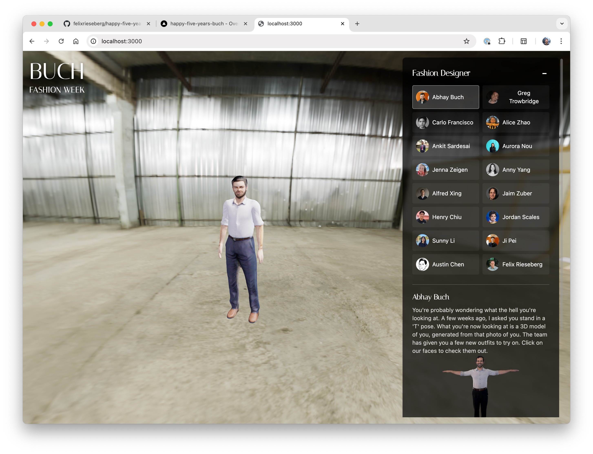
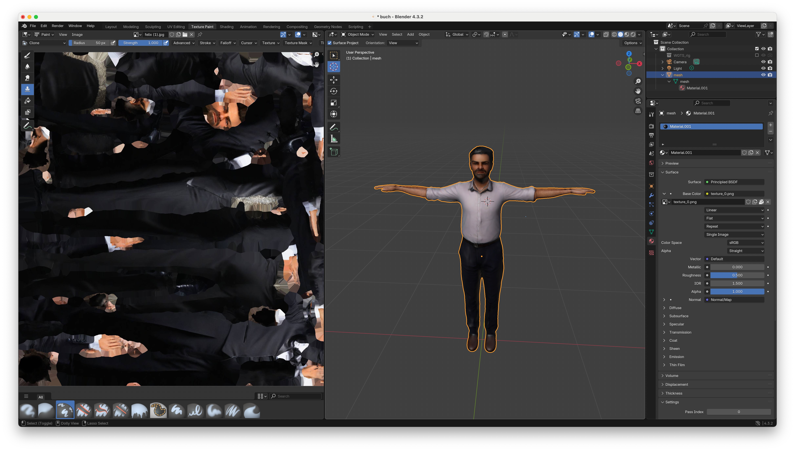
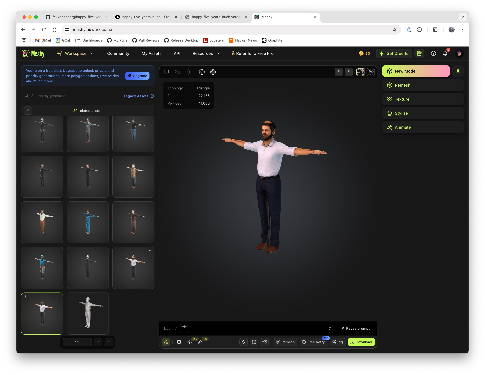
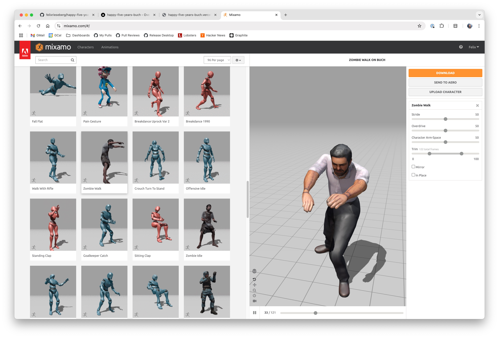
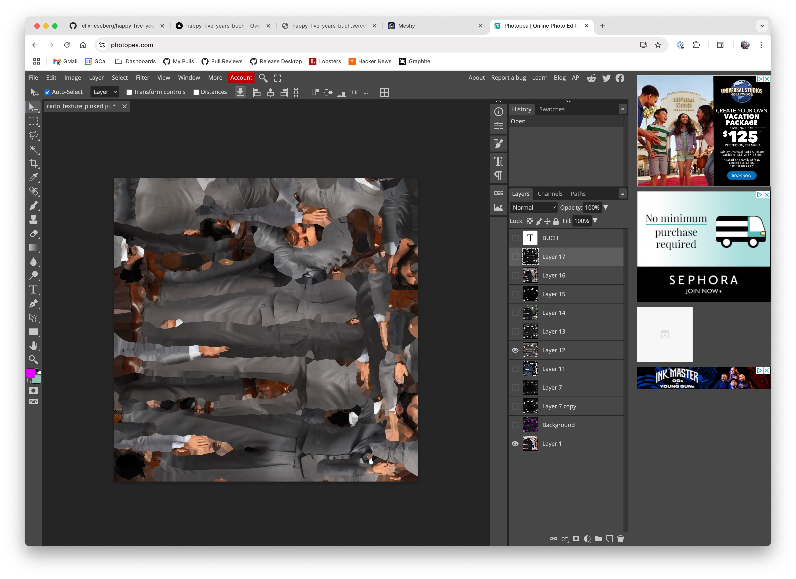

# happy-five-years-buch

This is a fancy e-card for my colleague's Buch's five year work anniversary.



## Workflow

This project is a 3D interactive e-card built with Next.js and Three.js (via React Three Fiber). It features a 3D model of Buch that can perform various animations in different environmental scenes. The workflow is roughly:

1. Take a T-pose photo of Buch and import it using Meshy.ai. Then, have Meshy create a 3D model from the photo. Then, create an albedo texture using the photo, again.
2. Clean up the model and texture in Blender: The texture will likely make some mistakes (for instance, it gave Buch a giant bald spot).
3. Create animations using Adobe Mixamo
4. Render it all with Three.js
5. Create additional "outfits" by generating textures using Meshy.ai, replace faces and skin from the original texture, and reimport into Three.js using materials. To clean up the face, I used Blender to "mark" face, skin, and hair with a pink color that is easily selectable and replaceable even in an albedo format.

[](screens/blender.jpeg)
[](screens/meshy.jpeg)
[](screens/mixamo.jpg)
[](screens/photopea.jpeg)


### Project Structure

- **Framework**: Next.js with TypeScript
- **3D Rendering**: Three.js with React Three Fiber and Drei
- **Styling**: TailwindCSS

### Key Components

1. **BuchCanvas**: The main component that renders the 3D scene with:
   - A 3D model of Buch
   - Environmental lighting and scene settings
   - Camera controls for user interaction

2. **BuchModel**: Handles the 3D model loading and animations:
   - Loads FBX models for different animations
   - Applies textures to the model
   - Manages animation playback

3. **FloatingMenu**: The UI component that allows users to:
   - Select different characters (with Buch as the default)
   - Choose from various animations (idle, dance, catwalk, etc.)
   - Switch between different environmental scenes

### State Management

The app uses React Context for state management:

- **ModelContext**: Manages the selected user and animation
- **SceneContext**: Handles scene selection and configuration
- **LightingContext**: Controls environmental lighting settings

### Features

- Interactive 3D model that can be rotated and zoomed
- Multiple animations for the character
- Various environmental scenes with different lighting
- User selection to view different characters
- Responsive design that works on different devices

## Getting Started

First, run the development server:

```bash
npm run dev
# or
yarn dev
# or
pnpm dev
# or
bun dev
```

Open [http://localhost:3000](http://localhost:3000) with your browser to see the result.

